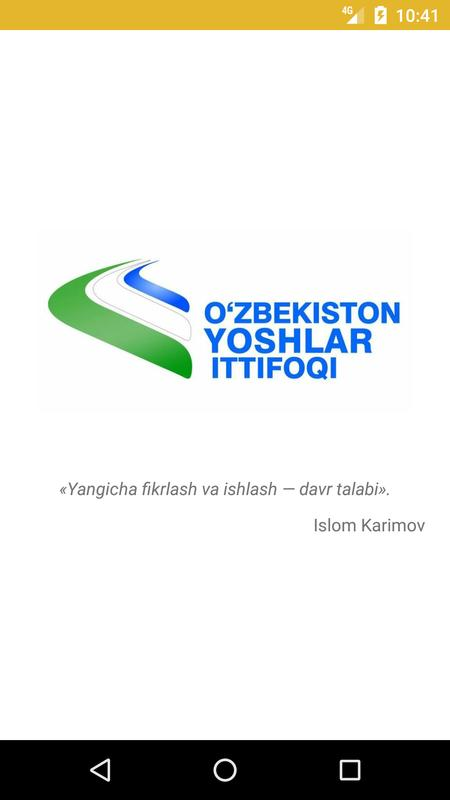
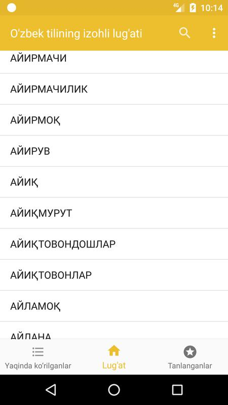
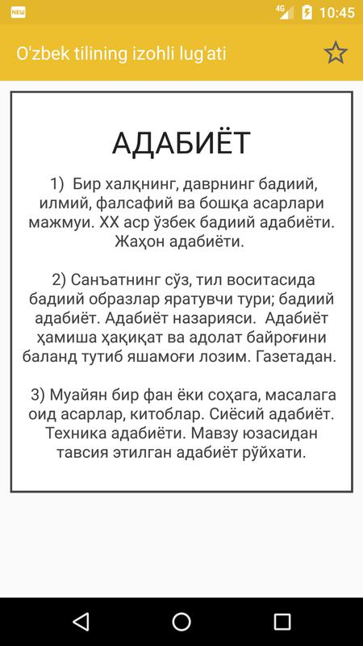
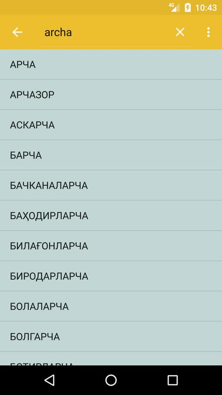
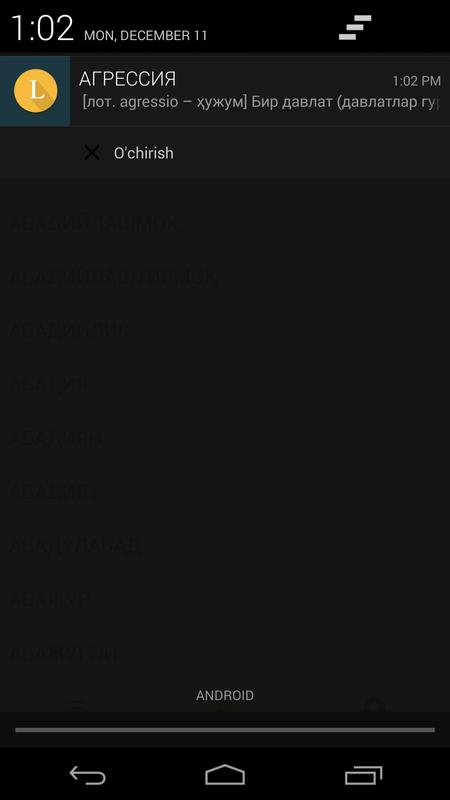
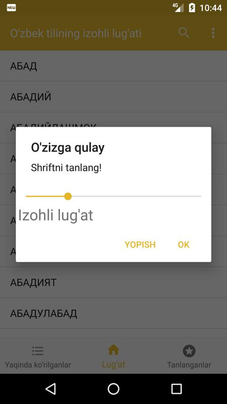

# Izohli Lug‘at

Izohli Lug‘at is the first Uzbek explanatory dictionary application. It's designed to help users find the meanings and definitions of Uzbek words. It’s a convenient tool for both native speakers and learners of the Uzbek language.

## Inspiration
The Uzbek language is rich and diverse, yet many people lack easy access to a comprehensive dictionary that can help them better understand the meanings and nuances of words. Izohli Lug‘at was created to address this gap and make language learning more accessible.

## How It Works
1. Users enter an Uzbek word into the search bar.
2. The application retrieves the definition and explanation of the word from the dictionary.
3. The result is displayed in a clear and user-friendly interface for easy reading and understanding.

## Author: Jasurbek(Jasur) Shukurov 
## In Partneship with: Youth Union of Uzbekistan

Used libriries: SQLite  

O'zbek tilining izohli lug'ati

<a target="_blank" href="https://play.google.com/store/apps/details?id=uz.shukurov.izohlilugat"> Play Store </a>

#Screenshots 

        

        

The app was created by Jasur Shukurov in 12/2017
